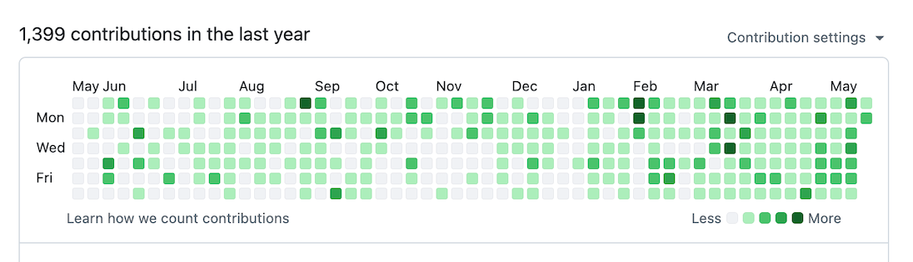

I heard about the 1% Rule the first time from Povilas from Laravel Daily. It's a concept that [James Clear](https://jamesclear.com/the-1-percent-rule) came up with and can be explained in one sentence:

> Improving something by just 1% a day will compound in massive progress over time.

And this can easily be applied to getting stuff done: instead of taking the time to work on big features for 5h a day until 2am, take small steps every day to get the thing done.

### Task Burnout

While I did not completely break down under the heavy weight of my to-do list, I noticed how I struggled a lot to even start doing something. At the end of 2025, I barely did anything useful and a lot of tasks and ideas piled up. Dozens of ideas, spread across different projects and their to-do lists. I even had to add detailed notes to the tasks to not forget anything because they idled on the to-do list for such a long time.

Somewhere around January, I decided to restructure my work because of this shitty situation.  

### Restructuring 

First, I needed a better overview on all the stuff I had to do. I now have a Kanban-style overview, each column for different life areas, with their corresponding tasks in them. This gave me a considerably better picture of all the things to do:

- Refactoring the whole exploring experience of Cloudhiker so that additional filters could be built in.
- Adjusting my personal dashboard to properly show daily summaries.
- Rebuilding my home lab around a central Forgejo instance and rewriting the Ansible scripts from scratch.
- Releasing LinkAce with new features and patching a few security issues.
- Reading a few books like "Crucial Conversations".
- Taking my car to the shop for tire and oil change.

And probably a dozen other tasks all going into the same direction.

### Improving my Projects 1% at a time

Now comes the fun part: instead of sitting down to work on that Cloudhiker feature for like 3h, I decided to first write down the things I had in mind.

And then stop.

I can tell you: stop doing a task while there's like 95% work left felt _really weird_. Like aren't I supposed to do something now? Yet, this was exactly what I needed: just write down stuff, getting details out of my head. I had my head free of all the clutter and could finally focus on whatever I wanted to do. And that was it for the first few days.

After that I started working on those tasks in very small potions. Just like 10-15 minutes a day, sometimes an hour, depending on how much time I could take each day. I ran into the same situation as before: I did some changes until one of the checkboxes for that task could be ticked, and then stop. For example, convert the notes into a specific task list, or doing the first fundamental code changes. It felt weird again, and I had to resist the urge to continue working hours on the task.

### Astonishing Results

Now, after more than 2 months of doing small changes every day, I feel way better than months before. It feels like I have more free time, despite completing a lot of tasks over the course of the week. It's interesting how stopping "in between" led to better results than pushing through with force and less sleep.

My conclusion: improving something in small steps is far easier and leads to better results than doing the heavy lifting all at once.
